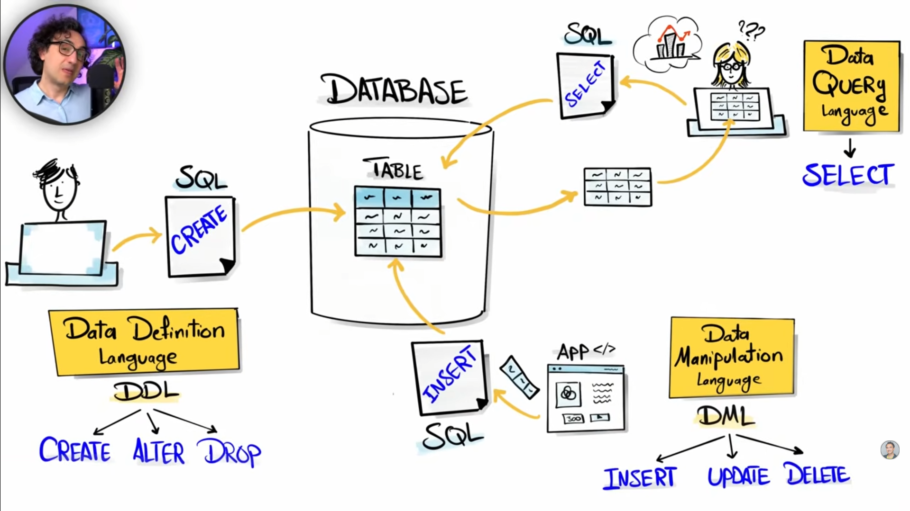

# Introduction

Alright — quick and clear.

**SQL (Structured Query Language)**

- A language for **storing, retrieving, and manipulating** data in databases.
- Works with **structured data** stored in **tables** (rows & columns).
- Lets you **query** large datasets with commands like `SELECT`, `INSERT`, `UPDATE`, `DELETE`.
- Used with **database systems** like MySQL, PostgreSQL, SQLite, etc.
- Best for **multi-user**, **large-scale**, and **automated** data operations.

**Spreadsheets (Excel, Google Sheets, etc.)**

- File-based tools for **manually** storing and analyzing data.
- Data is also in rows & columns but stored **locally** (or in the cloud as a file).
- Great for **small datasets**, quick calculations, and visual charts.
- Easy to use without programming.
- Limited performance for very large datasets or complex multi-user access.

**Main Differences**

| Feature            | SQL (Databases)              | Spreadsheets                    |
| ------------------ | ---------------------------- | ------------------------------- |
| **Storage**        | Database server              | Local/cloud file                |
| **Size handling**  | Millions+ rows efficiently   | Slows down after \~100k rows    |
| **Access**         | Multi-user, simultaneous     | One person (or small collab)    |
| **Automation**     | Very high (scripts, APIs)    | Limited (macros, formulas)      |
| **Data integrity** | Enforced rules (constraints) | Manual control                  |
| **Speed**          | Optimized for queries        | Slower for large data           |
| **Best for**       | Big, shared, structured data | Small, quick, personal analysis |

If you think of **spreadsheets** as a “personal notebook for data,” then **SQL databases** are more like a “central library with a powerful search system.”

---

### **1. Database**

- **What it is:**
  A structured collection of data (tables, rows, columns).
- **Example:**
  A file that stores customer records with names, emails, and orders.
- **Analogy:**
  Like a **library** full of books (data).

---

### **2. DBMS (Database Management System)**

- **What it is:**
  Software that **manages** a database — lets you store, retrieve, update, and organize data.
- **Examples:** MySQL, PostgreSQL, Oracle Database, SQLite.
- **Analogy:**
  The **librarian** who knows where everything is and how to fetch it.

---

### **3. SQL (Structured Query Language)**

- **What it is:**
  A **language** for interacting with a DBMS — telling it what to do with the data.
- **Example:**
  `SELECT * FROM customers WHERE city = 'Cairo';`
- **Analogy:**
  The **language** you speak to give the librarian instructions.

---

### **4. Server**

- **What it is:**
  The **computer** (physical or cloud-based) that runs the DBMS and stores the database.
- **Example:**
  A cloud server running MySQL for an online store.
- **Analogy:**
  The **building** where the library (database) is located.

---

**How they work together:**

1. **Database** → the data itself.
2. **DBMS** → software that controls the database.
3. **SQL** → the commands you use to talk to the DBMS.
4. **Server** → the machine where the DBMS and database live.

---

### Database Types (SQL vs NO_SQL)

| Type             | Structure               | Best For                           | Example DBs       |
| ---------------- | ----------------------- | ---------------------------------- | ----------------- |
| **Relational**   | Tables (rows & columns) | Structured data with relationships | MySQL, PostgreSQL |
| **Key–Value**    | Key → Value pairs       | Fast lookups, caching              | Redis, DynamoDB   |
| **Column-based** | Columns stored together | Analytics on large datasets        | Cassandra, HBase  |
| **Graph**        | Nodes + Edges           | Relationships & networks           | Neo4j, ArangoDB   |
| **Document**     | JSON-like documents     | Flexible, semi-structured data     | MongoDB, CouchDB  |

---

### Database tree


---

### Types of commands



---

### **DDL (Data Definition Language)** — *structure*

* **`CREATE`** → Make a new database object (table, view, index).

  ```sql
  CREATE TABLE users (id INT, name VARCHAR(50));
  ```
* **`ALTER`** → Change an existing object (add/remove columns, modify type).

  ```sql
  ALTER TABLE users ADD email VARCHAR(100);
  ```
* **`DROP`** → Permanently delete an object.

  ```sql
  DROP TABLE users;
  ```
* **`TRUNCATE`** → Remove **all rows** from a table, but keep its structure.

  ```sql
  TRUNCATE TABLE users;
  ```

---

### **DML (Data Manipulation Language)** — *data*

* **`INSERT`** → Add new rows of data.

  ```sql
  INSERT INTO users (id, name) VALUES (1, 'Ahmed');
  ```
* **`UPDATE`** → Change existing data.

  ```sql
  UPDATE users SET name = 'Ali' WHERE id = 1;
  ```
* **`DELETE`** → Remove specific rows.

  ```sql
  DELETE FROM users WHERE id = 1;
  ```

---

### **DQL (Data Query Language)** — *read*

* **`SELECT`** → Retrieve data from one or more tables.

  ```sql
  SELECT name, email FROM users WHERE id = 1;
  ```
