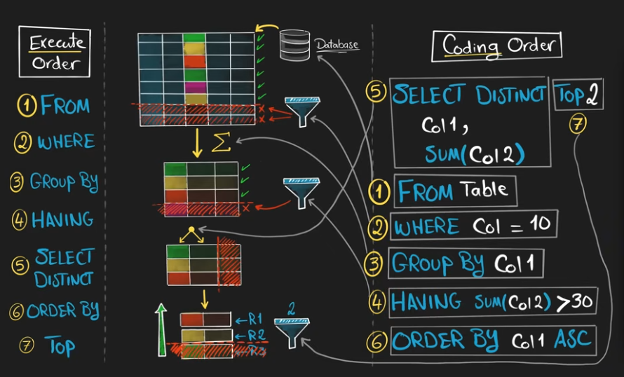

### **Query Data (SELECT)**

### Basic Syntax

```sql
SELECT column1, column2, ...
FROM table_name;
```

* **SELECT** → which columns you want.
* **FROM** → which table you want the data from.

---


1. ### **Get all data from Students table:**

```sql
SELECT * FROM Students;
```

---

2. ### **Get only specific columns (Name and Age):**

```sql
SELECT Name, Age FROM Students;
```

---

3. ### **Get data with a condition (WHERE):**

```sql
SELECT * FROM Students WHERE Age > 20;
```

<u style="color: purple ; font-family: impact ;"><span style="color: purple ; font-family: impact ;">NOTE</span></u>
<br>
* when writing something in where that have character -> you need to use single quote
```sql
SELECT * FROM Students Where Country = 'Germany' 
```

---

4. ### **Get data sorted (ORDER BY):**

```sql
SELECT * FROM Students ORDER BY Age DESC; -- default is ASC
```
<u style="color: red ; font-family: impact ;"><span style="color: red ; font-family: impact ;">IMPORTANT</span></u>
<br>
- Column order in **`ORRDER BY`** is crucial, as sorting is sequential.  
---

5. ### **Group data (GROUP BY):**

```sql
SELECT 
    Country , 
    SUM(score) AS total_score 
FROM Students 
GROUP BY Country;
```
<u style="color: red ; font-family: impact ;"><span style="color: red ; font-family: impact ;">GROUP BY RULE</span></u>
<br>
- All columns in the **`SELECT`** must be either aggregated or included in the **`GROUP BY`**. 


```sql
SELECT 
    Country , 
    SUM(score) AS total_score , 
    COUNT(id)  AS total_customers 
FROM Students 
GROUP BY Country;
```
---
6. ### **`HAVING`**

```sql
SELECT 
    Country , 
    SUM(score) AS total_score , 
    COUNT(id)  AS total_customers 
FROM Students 
GROUP BY Country
HAVING SUM(score) > 800 ;
```

* **WHERE** → filters **rows before grouping**.
* **HAVING** → filters **groups after grouping (aggregate functions)**.

```sql
-- WHERE filters rows (before GROUP BY)
SELECT department, salary
FROM employees
WHERE salary > 5000;

-- HAVING filters groups (after GROUP BY)
SELECT department, AVG(salary) AS avg_salary
FROM employees
GROUP BY department
HAVING AVG(salary) > 5000;
```
---
7. ### **`DISTINCT`** → removes duplicate rows from the result set.

### Example

```sql
-- Without DISTINCT (duplicates included)
SELECT department
FROM employees;

-- With DISTINCT (unique values only)
SELECT DISTINCT department
FROM employees;
```

So `DISTINCT` makes sure you get **unique values**.
    
--- 
 8. ### **`TOP`** → limits the number of rows returned.

```sql
-- Get first 5 employees
SELECT TOP 5 *
FROM employees;

-- Get top 10% highest salaries
SELECT TOP 10 PERCENT *
FROM employees
ORDER BY salary DESC;
```

* `TOP (n)` → first **n rows**.
* `TOP (n) PERCENT` → first **n% rows**.

(Other SQL databases usually use `LIMIT` or `FETCH`, but in **T-SQL** we use `TOP`).

--- 

### **Execute order vs Code order**




